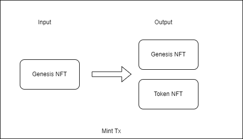
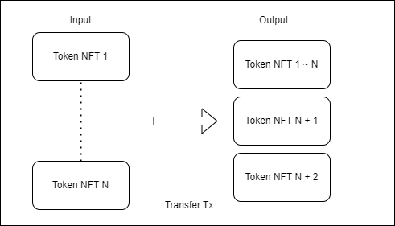

# Ordinals Token Protocol
Inspired by the [BRC-20 protocol](https://domo-2.gitbook.io/brc-20-experiment/), we propose a new implementation method for a token protocol. This protocol also uses ordinals as the underlying protocol and combines the properties of UTXO.

## BRC20
The BRC20 protocol uses ordinals as the data carrier to record token operations on the chain, thus achieving token minting and transfer.

The drawbacks we see:
> * 1 The problem of transaction order. The transaction order of BRC20 depends entirely on the order of the confirmed transaction in the block, which users cannot control. One problem this brings is that after receiving a token transfer tx, users must wait for the confirmation of the transfer tx before operating on the received token. User will need to wait about 10 minutes depending on the Bitcoin network.
> * 2 Each operation generates a new ordinals NFT, but the NFT only serves as a data carrier and has no other function.

## Ordinals Token

Based on the above drawbacks, we propose to use ordinals NFT as the property for tokens.  Since each token operation uses the previous ordinals NFT as the input for tx and generates a new ordinals NFT, this will form a UTXO dependency chain, so the token operation can share all the features the UTXO has.

### Deploy

In the deploy phase, the issuer of the token create a Ordinals NFT called Genesis NFT, which is used to mint new token NFTs, and only tokens minted by this Genesis NFT are valid. The Genesis Nft has the following data:
```
{
    "p": "orc-20",
    "sym": "test",
    "name": "test token name",
    "dec": "8",
    "max": "10000"
}
```

| Key | Required | Description|
| --- | --- | --- |
| p | Yes | Protocol: identify protocol |
| sym | Yes | Token symbol, max 10 letters |
| name | Yes | Token name, max 20 letters |
| dec | Yes | Token decimal precision |
| max | No | The max amount of token can be minted. If not given, the token can be minted unlimited |

### Mint

During the minting phase, a transaction must be constructed by an issuer with the input consisting of a specific Genesis NFT, and the output consisting of this same Genesis NFT along with a newly generated token NFT. 



The token NFT has following data:
```
{
    "p": "orc-20",
    "amt": "100000"
}
```

| Key | Required | Description|
| --- | --- | --- |
| p | Yes | Protocol: identify protocol |
| amt | Yes | token amount |

### Transfer

When a user transfers tokens, they must identify a collection of token NFTs associated with their address that contains at least the desired quantity of tokens to be transferred. This collection of token NFTs is used as the input for the transaction, and the output generates a new token NFT containing the desired quantity of tokens to be transferred. If change is required, an additional token NFT output is added.



### Features

Due to our reliance on Ordinals NFT as the credential for tokens, the token transactions has properties similar to satoshi UTXO. Without using RBF in transactions, we can further operate on the tokens while the transactions are unconfirmed after receiving new Token NFTs. The use of UTXO forms a dependency chain, which automatically sorts all token operations. With this feature, we can further develop token swap protocols.